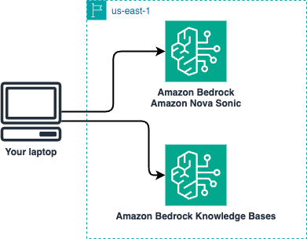
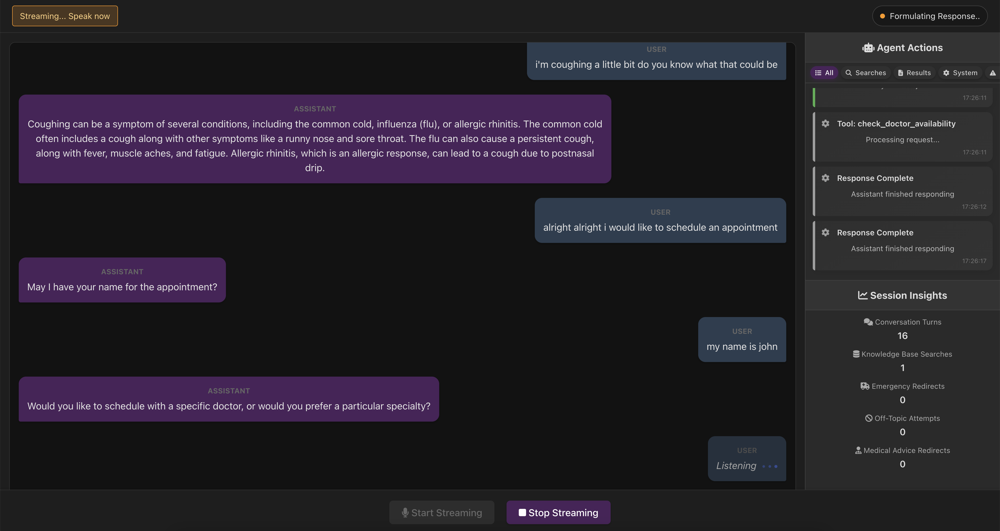

# Health Guide Assistant: Amazon Nova Sonic with Bedrock Knowledge Base

This project demonstrates how to build an intelligent conversational health assistant by integrating Amazon Nova Sonic model with Amazon Bedrock Knowledge Base. The application enables natural speech-to-speech interactions while leveraging a health knowledge base to provide informational responses about health topics.

## Solution Design



### Architecture Overview

This application implements a real-time speech-to-speech health assistant using a WebSocket-based architecture that enables bidirectional audio streaming between the browser and the Amazon Nova Sonic model.

### Key Architectural Components

1. **Frontend (Browser)**
   - WebAudio API for audio capture and playback
   - Socket.IO client for real-time WebSocket communication
   - Web-based UI for conversation monitoring and agent actions

2. **Backend (Node.js Server)**
   - Express.js HTTP server with Socket.IO for WebSocket management
   - TypeScript-based AI agent orchestration engine
   - Direct integration with AWS Bedrock services
   - Session management for concurrent users

3. **AWS Services**
   - Amazon Nova Sonic for speech-to-speech AI capabilities
   - Amazon Bedrock Knowledge Base for health information retrieval
   - Vector database for semantic search

### Security Requirements for Remote Deployment

**Important**: This application requires secure contexts (HTTPS) for microphone access when deployed beyond localhost.

#### Why SSL/TLS is Required

Modern browsers enforce strict security policies for accessing sensitive APIs like `getUserMedia()` (microphone access):

- **Localhost Exception**: Browsers allow microphone access over HTTP only on `localhost` and `127.0.0.1`
- **Remote Access Requirement**: Any other hostname (including EC2 public IPs, custom domains, or local network IPs) requires HTTPS
- **Browser Security Model**: This is a fundamental browser security feature to protect users from unauthorized audio/video capture

## ⚠️ Important Disclaimers

**This application is for educational and informational purposes only. It is NOT a substitute for professional medical advice, diagnosis, or treatment.**

**This application is a DEMO and should not be used in production environments.**

- Always consult with qualified healthcare professionals for medical concerns
- Never disregard professional medical advice or delay seeking it because of information from this application
- This system has built-in safety measures to redirect emergency situations to appropriate resources
- The AI assistant will not provide medical diagnoses or specific treatment recommendations
- This demo is intended for testing and evaluation purposes only
- Production use would require additional security, compliance, and reliability considerations

By using this application, you acknowledge that you understand these limitations.

## Application Interface



The application features a modern, intuitive interface with:
- **Real-time chat interface** with speech-to-text capabilities
- **Agent Actions panel** showing AI tool usage and analytics
- **Audio controls** for seamless voice interaction
- **Live conversation monitoring** with turn-by-turn analysis
- **Safety metrics** tracking emergency and off-topic redirects

## Key Features

- **AI Agentic Architecture**: Intelligent tool selection and orchestration using Amazon Nova Sonic's advanced reasoning capabilities
- **Health Knowledge Base Integration**: Retrieves accurate information from health resources stored in Amazon Bedrock Knowledge Base
- **Real-time Speech-to-Speech**: Bidirectional WebSocket-based audio streaming with Amazon Nova Sonic model
- **Advanced Tool System**: 7 specialized tools for health information, appointments, and safety responses
- **Natural Conversational Experience**: Seamless interaction through a responsive web interface
- **Contextual Health Information**: AI-generated responses informed by knowledge base content
- **Safety Guardrails**: Built-in redirects for emergency situations and medical advice boundaries
- **Appointment Management**: Complete scheduling system with availability checking and booking
- **Multi-platform Support**: Web interface with comprehensive agent action monitoring and analytics

## AI Agentic Architecture

This application demonstrates advanced AI agent capabilities through Nova Sonic's intelligent tool selection and orchestration:

### **Tool System Overview**

The AI agent has access to **7 specialized tools** that it selects autonomously based on user intent:

#### **Health Information Tools**
1. **`retrieve_health_info`** - Searches the health knowledge base for medical information
2. **`greeting`** - Provides personalized introductions and welcomes
3. **`safety_response`** - Handles inappropriate requests with proper boundaries

#### **Appointment Management Tools**
4. **`check_doctor_availability`** - Queries doctor schedules by specialty or ID
5. **`check_appointments`** - Retrieves existing appointments for patients or doctors
6. **`schedule_appointment`** - Books new appointments after collecting required information
7. **`cancel_appointment`** - Cancels existing appointments with proper confirmation

### **Intelligent Tool Orchestration**

The Nova Sonic model demonstrates sophisticated reasoning by:
- **Context-aware tool selection**: Automatically chooses appropriate tools based on user queries
- **Multi-step workflows**: Chains tools together (e.g., check availability → collect info → schedule appointment)
- **Information validation**: Ensures all required data is collected before executing actions
- **Safety prioritization**: Always applies safety checks before processing requests

### **Agentic Behavior Examples**

```
User: "I need to see a cardiologist next week"
Agent Process:
1. Uses check_doctor_availability with specialty="Cardiology"
2. Presents available options with calendar formatting
3. Collects patient information systematically
4. Uses schedule_appointment only after all data is gathered
5. Confirms booking with appointment details
```

The agent maintains conversation context across tool calls and provides natural, flowing interactions while ensuring all safety and business logic requirements are met.

### Health Knowledge Base Workflow

```
User Speech → Amazon Nova Sonic → Safety Check → Tool Use Detection → Bedrock KB Query → 
                                       ↓                                         ↓
                               Emergency Response                            Vector DB
                                       ↓                                         ↓
User ← Audio Output ← Amazon Nova Sonic ← Safety Response ← Retrieved Health Context
```

## Repository Structure

```
.
├── backend/                # Backend TypeScript application
│   ├── src/                # TypeScript source files
│   │   ├── client.ts       # AWS Bedrock client implementation
│   │   ├── bedrock-kb-client.ts # AWS Bedrock Knowledge Base client
│   │   ├── server.ts       # Express server implementation
│   │   ├── consts.ts       # Constants including tool schemas and configurations
│   │   ├── types.ts        # TypeScript type definitions
│   │   ├── appointment-service.ts # Backend appointment management
│   │   └── appointment-tools.ts # Backend appointment tools
│   ├── dist/               # Compiled JavaScript (auto-generated)
│   └── tsconfig.json       # TypeScript configuration
├── frontend/               # Frontend JavaScript application
│   ├── src/                # Frontend source code
│   │   ├── main.js         # Main application entry point
│   │   ├── audio-handler.js # Audio processing and streaming
│   │   ├── chat-ui.js      # Chat interface management
│   │   ├── action-panel.js # Agent actions and analytics
│   │   ├── socket-events.js # WebSocket event handling
│   │   ├── ui-manager.js   # UI interaction management
│   │   ├── appointment-service.js # Frontend appointment management
│   │   ├── AppointmentDatabase.js # Client-side appointment data
│   │   └── lib/            # Utility libraries
│   ├── css/                # Stylesheets
│   └── index.html          # Main application entry point
├── kb/                     # Knowledge Base source files
│   └── health-documents/   # Sample health information documents for KB
└── package.json            # Project configuration and scripts
```

## Full-Stack Architecture

This application uses a **full-stack TypeScript/JavaScript architecture**:

### Backend (TypeScript) - AI Agent Engine
- **Source**: `src/*.ts` files
- **Compiled**: `dist/*.js` files (via TypeScript compiler)
- **Purpose**: AI agent orchestration, AWS integration, tool management, business logic
- **Key Components**:
  - `client.ts` - Nova Sonic bidirectional streaming and tool processing
  - `consts.ts` - Tool schemas and AI agent configuration
  - `appointment-tools.ts` - Appointment management business logic
  - `bedrock-kb-client.ts` - Knowledge base integration
  - `server.ts` - WebSocket server and session management
- **Commands**: 
  - `npm run dev` - Development server with hot reload
  - `npm run build` - Compile TypeScript to JavaScript
  - `npm start` - Production server

### Frontend (JavaScript)
- **Source**: `public/src/*.js` files
- **Purpose**: Browser-side UI, audio handling, real-time communication
- **Features**: Speech recognition, audio playback, agent action monitoring

## Setting Up the Health Knowledge Base

### Prerequisites
- Node.js (v16 or higher)
- AWS Account with Bedrock access
- **Amazon Nova Sonic model enabled in Bedrock**:
  1. Go to AWS Bedrock Console
  2. Navigate to "Model access" in the left sidebar
  3. Click "Manage model access"
  4. Find "Amazon Nova Sonic" and enable it
  5. Wait for the status to show "Access granted"
- AWS CLI configured with appropriate credentials
- Modern web browser with WebAudio API support

### Creating Your Health Knowledge Base

Before running the application, you must create a Knowledge Base in Amazon Bedrock:

1. **Access the AWS Bedrock Console**:
   - Navigate to the AWS Management Console
   - Search for "Amazon Bedrock" and open the service

2. **Create a New Knowledge Base**:
   - In the left navigation pane, select "Knowledge bases"
   - Click "Create knowledge base"
   - Follow the wizard to create a new knowledge base with vector store
   - Choose a name like "HealthGuideKB"

3. **Configure Data Source**:
   - Select "Upload files" as your data source using S3
   - Upload health information documents to your knowledge base
   - Configure chunking settings with semantic chunking
   - Select all files available on kb/files directory, which include a few markdown and metadata files (JSON)

4. **Complete Setup**:
   - Review your settings and create the knowledge base
   - Once created, note your Knowledge Base ID for the next step

5. **Update Application Configuration**:
   - Open `src/client.ts`
   - Replace the placeholder with your actual Knowledge Base ID:

```typescript
// Replace with your actual Knowledge Base ID
const KNOWLEDGE_BASE_ID = 'YOUR_KB_ID_HERE';
```

## Installation and Setup

1. **Clone the repository**:
```bash
git clone <repository-url>
cd <repository-name>
```

2. **Install dependencies**:
```bash
npm install
```

3. **Configure AWS credentials**:
```bash
# Configure AWS CLI with your credentials
aws configure --profile bedrock-test
```

4. **Build the TypeScript backend**:
```bash
npm run build
```

## Running the Application

### Development Mode
```bash
npm run dev
```

### Production Mode
```bash
npm run build
npm start
```

### Access the Application
1. Open your browser to: `http://localhost:4000`

2. **For EC2 deployment**, you may want to create an SSH tunnel before opening your browser so you dont need to expose your app to the internet or add a certificate:
```bash
ssh -i /your/key.pem -L 4000:localhost:4000 ec2-user@your-ec2-ip
```

Note: If you are using EC2, make sure SSH is allowed to your workstation.

3. Grant microphone permissions when prompted

4. Start asking health-related questions to see the Knowledge Base in action:
   - "What are the symptoms of the common cold?"

5. Test other tools:
   - "I would like to schedule an appointment"

6. Check the "Agent Actions" panel for more details about the AI Agent tools and logs

## Safety Features

The application includes several safety mechanisms:

1. **Emergency Detection**: Automatically detects emergency situations and provides 911 guidance
2. **Medical Advice Boundaries**: Redirects requests for medical diagnoses or treatment
3. **Off-Topic Handling**: Politely redirects non-health questions back to health topics
4. **Appropriate Disclaimers**: All responses include appropriate health disclaimers

## Agent Actions Monitoring

The application includes a comprehensive monitoring panel that tracks:
- **Conversation Turns**: Number of user interactions
- **Knowledge Base Searches**: Queries to the health knowledge base
- **Emergency Redirects**: Emergency situations detected
- **Off-Topic Attempts**: Non-health questions asked
- **Medical Advice Redirects**: Inappropriate medical advice requests

## Testing Health Knowledge Base Retrieval

To verify the Knowledge Base integration:

1. Ask a health-related question
2. The system should:
   - Recognize the question requires knowledge base information
   - Query the knowledge base for relevant content
   - Provide an accurate response with appropriate disclaimers

3. Check server logs:
```bash
npm start | grep "Knowledge Base"
```

## Project Scripts

```json
{
  "scripts": {
    "build": "tsc",                    // Compile TypeScript
    "start": "node dist/server.js",    // Start production server
    "dev": "ts-node src/server.ts",    // Start development server
    "clean": "rm -rf dist/",           // Clean compiled files
    "rebuild": "npm run clean && npm run build" // Full rebuild
  }
}
```

## Deployment Considerations

This application is primarily designed for **local development on your laptop**, which minimizes costs and complexity. However, it can also be deployed on EC2 or other computing platforms with proper SSL configuration.

### Recommended Deployment

- **Primary**: Local laptop/desktop (localhost:4000)
  - No SSL certificates needed
  - No hosting costs
  - Immediate development and testing
  - Full microphone access

- **Secondary**: EC2 or cloud instances
  - Requires SSL setup (see Architecture section)
  - Additional hosting costs
  - Suitable for demos and sharing

## 💰 Cost Considerations

### AWS Service Costs

When running this application, you will incur costs for:

1. **Amazon Bedrock**
   - **Nova Sonic model**: Charged per input/output tokens
   - **Knowledge Base**: Storage and retrieval costs
   - **Vector database (OpenSearch Serverless)**: Minimum charges apply even when idle

2. **AWS S3** (for Knowledge Base documents)
   - Storage costs for uploaded health documents
   - Generally minimal for demo purposes

3. **EC2 Instance** (if deployed remotely)
   - Instance hourly rates based on type
   - t3.micro eligible for free tier
   - Costs vary by instance type and region

### Cost Optimization Tips

- **Development**: Use localhost to avoid EC2 costs
- **Testing**: Limit conversation length to reduce token usage
- **Knowledge Base**: Use minimum documents needed for testing
- **Shut down resources** when not in use

## 🧹 Cleanup Instructions

To avoid ongoing charges, follow these steps to delete all resources:

### 1. Stop the Application

```bash
# Stop the Node.js server
# Press Ctrl+C in the terminal running the server

# If running on EC2, also stop the instance
aws ec2 stop-instances --instance-ids <your-instance-id>
```

### 2. Delete Bedrock Knowledge Base

```bash
# List knowledge bases
aws bedrock-agent list-knowledge-bases

# Delete the knowledge base (replace with your KB ID)
aws bedrock-agent delete-knowledge-base --knowledge-base-id YOUR_KB_ID

# Note: This may take several minutes
```

### 3. Clean Up S3 Bucket

```bash
# List and delete objects in your KB bucket
aws s3 rm s3://your-kb-bucket-name --recursive

# Delete the bucket
aws s3 rb s3://your-kb-bucket-name
```

### 4. Delete OpenSearch Serverless Collection

If you created an OpenSearch Serverless collection for the Knowledge Base:

1. Go to AWS Console → OpenSearch Service
2. Select "Serverless collections"
3. Find your collection and delete it
4. Also delete any associated security policies

Note: If you are using a different vector store, please check our document pages for more details.

### 5. Terminate EC2 Instance (if used)

```bash
# Terminate EC2 instance permanently
aws ec2 terminate-instances --instance-ids <your-instance-id>

# Delete associated security groups
aws ec2 delete-security-group --group-id <security-group-id>

# Release Elastic IP (if allocated)
aws ec2 release-address --allocation-id <allocation-id>
```

### 6. Clean Up Local Files

```bash
# Remove node modules and build artifacts
rm -rf node_modules/
rm -rf dist/
rm -rf package-lock.json

# Remove any SSL certificates (if created)
rm -rf certs/
```

### 7. Verify Resource Deletion

Check AWS Cost Explorer after 24 hours to ensure no resources are still running:

```bash
# Check for any remaining Bedrock resources
aws bedrock-agent list-knowledge-bases
aws bedrock-agent list-data-sources --knowledge-base-id YOUR_KB_ID

# Check S3 buckets
aws s3 ls

# Check EC2 instances
aws ec2 describe-instances --query 'Reservations[].Instances[?State.Name!=`terminated`]'
```

### Important Cost Notes

⚠️ **OpenSearch Serverless Minimum Charges**: Even when idle, OpenSearch Serverless collections have minimum charges. Delete them when not in use.

⚠️ **Bedrock Model Costs**: Conversations are charged per token. Long conversations can accumulate costs quickly.

⚠️ **Free Tier Limits**: Be aware of AWS Free Tier limits, especially for EC2 and S3.

## Troubleshooting

### Knowledge Base Issues
1. **Knowledge Base Not Responding**:
   - Verify your Knowledge Base ID in `src/client.ts`
   - Check AWS credentials and permissions
   - Ensure knowledge base status is "Available"

2. **Incorrect Health Information**:
   - Verify health documents were properly ingested
   - Check chunking settings in AWS console
   - Ensure source documents are from reputable health sources

### Audio Issues
1. **Microphone Not Working**:
   - Check browser permissions
   - Ensure HTTPS (need to install/add certificate) or localhost
   - Try different browser (recommended to use Chrome)

2. **No Audio Output**:
   - Check browser audio settings
   - Verify WebSocket connection in browser console

3. Error `Error: {"source":"bidirectionalStream","error":{"name":"CredentialsProviderError","tryNextLink":false}}`
   - Check your AWS credentials

### General Connection Issues
1. Check server logs for errors
2. Verify WebSocket connection:
```javascript
socket.on('connect_error', (error) => {
  console.error('Connection failed:', error);
});
```

## Customizing the AI Agent

### **Adding New Tools**

To extend the agent's capabilities with new tools:

1. **Define Tool Schema** (in `src/consts.ts`):
```typescript
export const NewToolSchema = JSON.stringify({
  "type": "object",
  "properties": {
    "parameter": {
      "type": "string",
      "description": "Parameter description"
    }
  },
  "required": ["parameter"]
});
```

2. **Add Tool to Configuration** (in `src/consts.ts`, within `setupPromptStartEvent`):
```typescript
{
  toolSpec: {
    name: "new_tool_name",
    description: "Tool description for the AI agent",
    inputSchema: {
      json: NewToolSchema
    }
  }
}
```

3. **Implement Tool Logic** (in `src/client.ts`, within `processToolUse` method):
```typescript
case "new_tool_name":
    console.log(`Processing new tool: ${JSON.stringify(toolUseContent)}`);
    return this.processNewTool(toolUseContent);
```

4. **Create Tool Function**:
```typescript
private processNewTool(toolUseContent: any): Object {
    // Parse tool content
    const content = JSON.parse(toolUseContent.content || "{}");
    
    // Implement your tool logic here
    return {
        success: true,
        result: "Tool execution result"
    };
}
```

### **Modifying Agent Behavior**

**System Prompt** (in `src/consts.ts`):
- Modify `DefaultSystemPrompt` to change the agent's personality, capabilities, and conversation flow
- Add new guidelines for tool usage and conversation structure

**Tool Selection Logic**:
- The AI agent automatically selects appropriate tools based on the tool descriptions and system prompt
- Modify tool descriptions to influence when each tool is used

**Safety Boundaries**:
- Update the `safety_response` tool schema to handle new types of inappropriate requests
- Modify the safety response generation logic in `generateSafetyResponse` method

### **Knowledge Base Configuration**

**Updating Knowledge Base ID** (in `src/client.ts`):
```typescript
// Replace with your actual Knowledge Base ID
const KNOWLEDGE_BASE_ID = 'YOUR_KB_ID_HERE';
```

**Knowledge Base Query Parameters**:
- Modify `queryHealthKnowledgeBase` method to adjust search parameters
- Change `numberOfResults` for more or fewer search results

### **Audio and Voice Configuration**

**Voice Settings** (in `src/consts.ts`):
```typescript
export const DefaultAudioOutputConfiguration = {
    sampleRateHertz: 24000,
    voiceId: "tiffany", // Change voice here
};
```

Available voice options: `tiffany`, `marcus`, `aria`, `davis`, `jenny`, `gregory`

## Data Flow Architecture

```ascii
User Health Question → Browser → Server → AI Agent → Tool Selection & Orchestration
                                             ↓              ↓
                                    Safety Check    Knowledge Base Query
                                             ↓              ↓
                                    Emergency Check   Amazon Nova Sonic
                                             ↓              ↓
                                    Tool Execution    Response Generation
                                             ↓              ↓
         Audio Response ← Browser ← Server ← Generated Response + Disclaimers
```

## Infrastructure Requirements

- **Backend**: Node.js server with Express.js and Socket.IO
- **AI Agent Engine**: Amazon Nova Sonic with bidirectional streaming
- **Frontend**: Modern browser with WebAudio API support
- **AWS Services**: Bedrock Runtime, Bedrock Knowledge Base, Bedrock Agent Runtime
- **Real-time Communication**: WebSocket-based bidirectional streaming
- **Tool Management**: JSON schema-based tool definitions with automatic orchestration

## Contributing

We welcome community contributions! Please see [CONTRIBUTING.md](CONTRIBUTING.md) for guidelines.

## Security

See [CONTRIBUTING](CONTRIBUTING.md#security-issue-notifications) for more information.

## License

This library is licensed under the MIT-0 License. See the [LICENSE](LICENSE) file.

**This project is for educational purposes. Please ensure compliance with healthcare regulations in your jurisdiction before any production use.**
