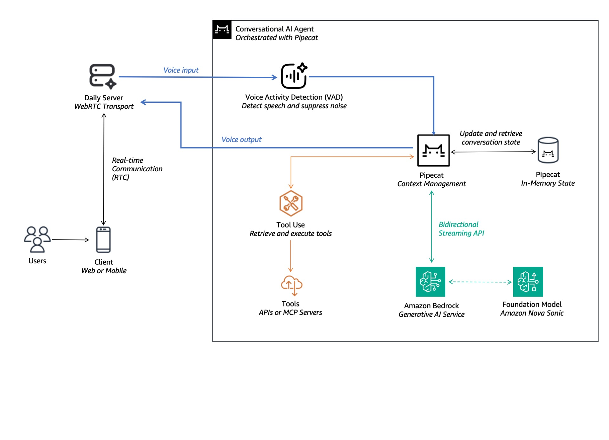

# Build Intelligent AI Voice Agents with Pipecat and Amazon Bedrock

This repo shows you how to build real-time, voice-enabled AI agents using [Pipecat](https://github.com/pipecat-ai/pipecat) and [Amazon Bedrock](https://aws.amazon.com/bedrock/) foundation models.

_⚠️ The solution is not production ready and is an illustrative example only. The solution relies on an API from AWS Partner, [Daily](https://www.daily.co/). Daily can be purchased on [AWS Marketplace](https://aws.amazon.com/marketplace/seller-profile?id=d52484b0-a717-4b6d-a7aa-82f1c0c40b35). In practice, please use a [secrets management service](https://docs.aws.amazon.com/prescriptive-guidance/latest/aws-startup-security-baseline/wkld-03.html) to manage API keys and credentials_

## Overview

The following diagram illustrates the high-level architecture of this solution:



Key components include:
- Daily WebRTC streaming with Voice Activity Detection (VAD)
- [Amazon Nova Sonic](https://aws.amazon.com/ai/generative-ai/nova/speech/) (Speech-to-Speech) model on Amazon Bedrock
- Function calling capabilities for retrieving information (like weather data)

Built by [AWS Generative AI Innovation Center](https://aws.amazon.com/ai/generative-ai/innovation-center/). Ideal for anyone looking to quickly prototype voice AI agents for various use cases.

## Quick Start

### First, start the bot server:

1. Navigate to the server directory:
   ```bash
   cd server
   ```
2. Create and activate a virtual environment:
   ```bash
   python3 -m venv venv
   source venv/bin/activate  # On Windows: venv\Scripts\activate
   ```
3. Install requirements:
   ```bash
   pip install -r requirements.txt
   ```
4. Update keys in .env:
    ```ini
    DAILY_API_KEY=XXXX
    AWS_ACCESS_KEY_ID=XXXX
    AWS_SECRET_ACCESS_KEY=XXXX
    AWS_REGION=XXXX
     ```
5. Start the server:
   ```bash
   python server.py
   ```

### Next, connect using the prebuilt client app:

1. Visit http://localhost:7860

2. Allow microphone access when prompted

3. Wait for the bot to speak

## Requirements

- Python 3.12+
- Daily API key
- AWS access keys
- Modern web browser with WebRTC support

## Project Structure

```
pipecat-voice-agent/
├── server/              # Bot server implementation
│   ├── bot.py           # Pipecat pipeline implementation
│   ├── server.py        # FastAPI server
│   └── requirements.txt
```

## Contributors

- [Adithya Suresh](https://www.linkedin.com/in/adithyaxx/) - Deep Learning Architect, AWS Generative AI Innovation Center

- [Daniel Wirjo](https://www.linkedin.com/in/wirjo/) - Senior Solutions Architect, AWS Generative AI Startups

## Security

See [CONTRIBUTING](CONTRIBUTING.md#security-issue-notifications) for more information.

## License

This library is licensed under the MIT-0 License. See the LICENSE file.
